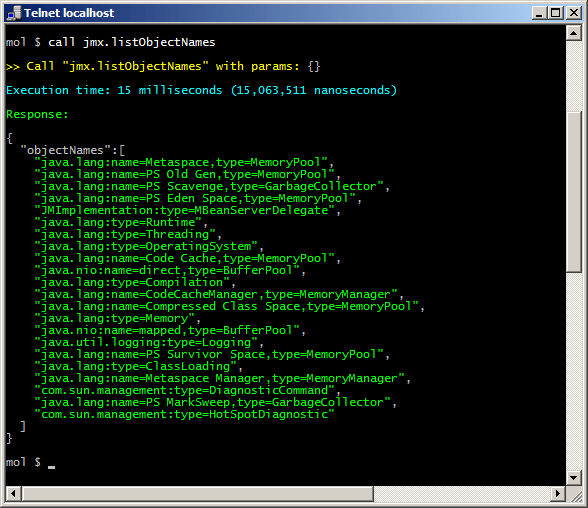
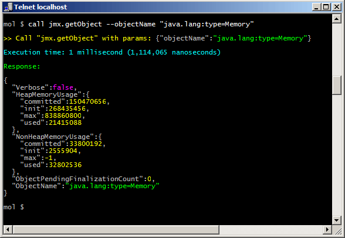
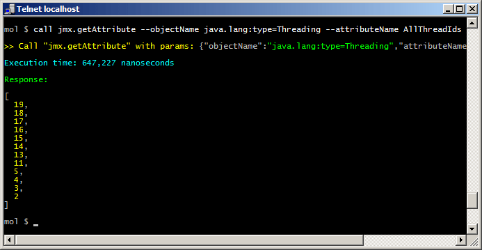
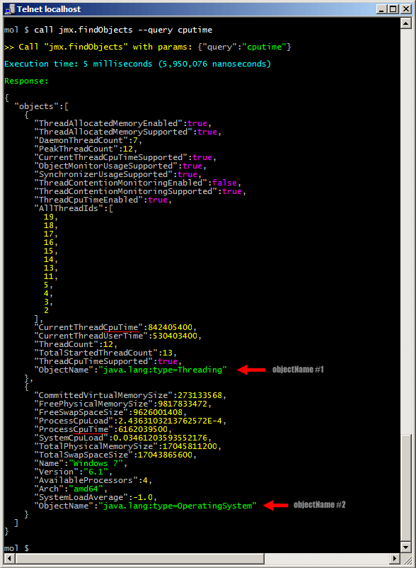

[](https://travis-ci.org/moleculer-java/moleculer-java-jmx)
[](https://www.codacy.com/app/berkesa/moleculer-java-jmx?utm_source=github.com&amp;utm_medium=referral&amp;utm_content=moleculer-java/moleculer-java-jmx&amp;utm_campaign=Badge_Grade)
[](https://codecov.io/gh/moleculer-java/moleculer-java-jmx)

# JMX Service for Moleculer

The "jmx" Moleculer Service allows you to easily query the contents stored in a local or a remote JMX Registry. With this service Java and Node.js-based Moleculer nodes can easily query java-specific data (eg. JVM's memory usage, number of threads, or various statistical data - for example, JMX Service provides access to low-level statistics to Cassandra, Apache Kafka or Elasticsearch Servers).

The other advantage of the JMXService is that it can monitor objects in the JMX registry, and sends events about the changes. This events can be received by any node subscribed to this event, including Node.js-based nodes.

## Download

**Maven**

```xml
<dependencies>
	<dependency>
		<groupId>com.github.berkesa</groupId>
		<artifactId>moleculer-java-jmx</artifactId>
		<version>1.0.1</version>
		<scope>runtime</scope>
	</dependency>
</dependencies>
```

**Gradle**

```gradle
dependencies {
	compile group: 'com.github.berkesa', name: 'moleculer-java-jmx', version: '1.0.1' 
}
```

## Usage from code

```java
ServiceBroker().builder()
               .build()
               .createService(new JmxService())
               .start();
```

## Usage with Spring Framework

```xml
<?xml version="1.0" encoding="UTF-8"?>
<beans xmlns="http://www.springframework.org/schema/beans"
	xmlns:xsi="http://www.w3.org/2001/XMLSchema-instance" xmlns:context="http://www.springframework.org/schema/context"
	xsi:schemaLocation="http://www.springframework.org/schema/beans
	   http://www.springframework.org/schema/beans/spring-beans-3.0.xsd
	   http://www.springframework.org/schema/context
	   http://www.springframework.org/schema/context/spring-context-3.0.xsd">

	<!-- ENABLE ANNOTATION PROCESSING -->

	<context:annotation-config />

	<!-- INSTALL USER-DEFINED MOLECULER SERVICES -->
	
	<context:component-scan base-package="my.services" />

	<!-- INSTALL JMX SERVICE -->

	<bean id="jmx" class="services.moleculer.jmx.JmxService" />

	<!-- SPRING REGISTRATOR FOR MOLECULER SERVICES -->

	<bean id="registrator" class="services.moleculer.config.SpringRegistrator" depends-on="broker" />

	<!-- SERVICE BROKER INSTANCE -->

	<bean id="broker" class="services.moleculer.ServiceBroker" init-method="start" destroy-method="stop">
		<constructor-arg ref="brokerConfig" />
	</bean>

	<!-- SERVICE BROKER SETTINGS -->

	<bean id="brokerConfig" class="services.moleculer.config.ServiceBrokerConfig">
		<property name="nodeID" value="node-1" />
	</bean>

</beans>
```

## JMX Commands

### List object (MBean) names

Invoke from REPL console:

```bash
mol $ call jmx.listObjectNames --query memory
```

Invoke from Java code:

```java
broker.call("jmx.listObjectNames").then(rsp -> {
  for (Tree item: rsp.get("objectNames")) {
    String objectName = item.asString();
  }
});
```

**Options**

```
    --query optional query string (eg. "memory" or "java.lang:*")
    --sort  sort list to alphanumeric order    
```

**Output**



### Get object (entire MBean)

Invoke from REPL console:

```bash
mol $ call jmx.getObject --objectName "java.lang:type=Memory"
```

Invoke from Java code:

```java
broker.call("jmx.getObject",
            "objectName",
            "java.lang:type=Memory").then(rsp -> {
  logger.info("Usage: " + rsp.get("HeapMemoryUsage.used", 0L));
});
```

**Options**

```
    --objectName name of the MBean (eg. "java.lang:type=Memory")
    --sort       sort attributes to alphanumeric order    
```

**Output**



### Get attribute

Invoke from REPL console:

```bash
mol $ call jmx.getAttribute --objectName java.lang:type=Memory
                            --attributeName AllThreadIds
```

Invoke from Java code:

```java
broker.call("jmx.getAttribute",
            "objectName",
            "java.lang:type=Memory",
            "attributeName",
            "AllThreadIds").then(rsp -> {
  for (Tree item: rsp) {
    logger.info("Thread ID: " + item.asLong());
  }
});
```

**Options**

```
    --objectName    name of the MBean (eg. "java.lang:type=Runtime")
    --attributeName attribute name (eg. "HeapMemoryUsage")
    --path          one property of the composite attribute (eg. "used")
    --sort          sort properties to alphanumeric order    
```

**Output**



### Find objects by a query string

Invoke from REPL console:

```bash
mol $ call jmx.findObjects --query cputime
```

Invoke from Java code:

```java
broker.call("jmx.findObjects",
            "query",
            "cputime").then(rsp -> {
  for (Tree item: rsp.get("objects")) {
    logger.info("Object name: " + item.get("ObjectName", "unknown"));
  }
});
```

**Options**

```
    --query query String (eg. "cputime" or "java.lang:*")
    --max   max number of retrieved objects (default is 64)
    --sort  sort attributes to alphanumeric order    
```

**Output**



# Sample project

* [Moleculer Java demo project with Gradle](https://github.com/moleculer-java/moleculer-java-gradle-demo/)

# License

moleculer-java-jmx is available under the [MIT license](https://tldrlegal.com/license/mit-license).
